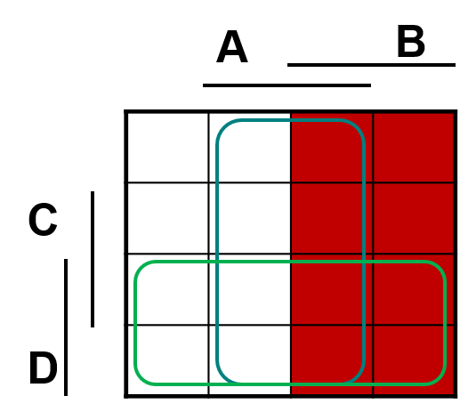
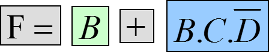

# Karnaughovy mapy
## Úvod
Jedná se o grafické vyjádření logické funkce. Jsou vhodné pro minimalizaci funkcí.

## Velikost
Karnaughova mapa je tabulka o počtu 2^N buněk, kde N je počet proměnných. Tabulka o 4 proměnných (*ABCD*) bude mít tedy velikost 16 buněk.

Čísla jsou indexy jednotlivých buněk. Ano to řazení tak opravdu je. Pruhem jsou označeny sloupce / řádky kde je proměnná přímá (bez negace). Zapisujeme 1 nebo 0 (není potřeba psát).

## Zápis do tabulky
### 1. Z funkce
Zadání: Minimalizujte funkci.

#### 1. Krok - Tabulka
Nakreslíme tabulku. O počtu 2^N buněk, kde N je počet proměnných, tj. 2^4.

#### 2. Krok - Zápis
V první řadě je potřeba si určit co a jak zapisujeme do tabulky. Jednotlivé proměnnné v členu (člen jsou proměnné spojené logickým součinem) mohou nabývat celkem 3 stavů - **Přímý**, **nepřímý** (negovaný) a **neurčitý** (není zapsán ve členu).

- Proměnná A v první členu je **přímá** - musí být ve sloupci A, viz. obrázek

 - Proměnná B v první členu je **nepřímá** (znegovaná) - nesmí být ve sloupci B, viz. obrázek

 - Proměnná C v první členu je **neurčitá** (není zapsaná) - musí se objevit v řádku C, ale **i mimo něj!** Pokud se proměnná v daném sloupci/řádku objeví a zároveň je i mimo něj - **nepíše se do vzorce!**
 - Proměnná D v první členu je **přímá** - musí se být v řádku D, viz. obrázek

Z následujících podmínek (zakreslené v obrázku) určíme místo zapsání jedniček. Víme tedy, že:
- Všechny musít být v A
- Všechny nesmí být v B
- Jedna musí být v C
- Všechny musí být v D

Zároveň ale víme, že jednička se musí objevit v C i mimo C (aby člen byl nepřímý a nezapisoval se). Tudíž musíme zapsat jednu další, pro kterou **platí všechny předchozí podmínky** až na:

- Nesmí být v C

Podle předchozích pravidel zapíšeme do tabulky.

Stejné aplikujeme na další člen.

A nakonec na 3. a zároveň poslední

#### 3. Krok - Smyčky

V následujícím zápisu určíme **tzv. smyčky**. Pro smyčky platí určitá pravidla
- uzavíráme pouze se sousedním
- smyčka má vždy 2N políček, tj. 1, 2, 4, 8 atd.
- smyčka má vždy tvar čtyřúhelníka
- smyčky se snažíme uzavírat co největší (aby byl výsledný člen co nejvíce zminimalizováný)
- počet smyček má být co nejmenší (každé smyčka je totiž jeden výsledný člen)
- všechny jedničky musí být uzavřeny ve smyčkách

Určíme tedy smyčky

#### 4. Krok - Výsledná funkce

Ze smyček již můžeme zapsat výslednou funkci. Postup je velmi podobný jako při zápisu.

Vyberu si první smyčku (zelená vlevo dole) a ptám se, kde všude se jednotlivé proměnné (ABCD) nachází:
- Nachází se ve sloupci A? **ANO**. Nachází se mimo sloupec A? **ANO**. - člen bude **neurčitý (nezapisuje se)**
- Nachází se ve sloupci B? **NE**. Nachází se mimo sloupec B? **ANO**. - člen bude **nepřímý (zneguje se)**
- Nachází se ve sloupci C? **ANO**. Nachází se mimo sloupec C? **ANO**. - člen bude **neurčitý (nezapisuje se)**
- Nachází se ve sloupci D? **ANO**. Nachází se mimo sloupec D? **NE**. - člen bude **přímý**

Tato smyčka bude mít tedy následující zápis

Vyberu si druhou smyčku a ptám se, kde všude se jednotlivé proměnné (ABCD) nachází:
- Nachází se ve sloupci A? **ANO**. Nachází se mimo sloupec A? **ANO**. - člen bude **neurčitý (nezapisuje se)**
- Nachází se ve sloupci B? **NE**. Nachází se mimo sloupec B? **ANO**. - člen bude **přímý**
- Nachází se ve sloupci C? **ANO**. Nachází se mimo sloupec C? **NE**. - člen bude **přímý**
- Nachází se ve sloupci D? **NE**. Nachází se mimo sloupec D? **ANO**. - člen bude **nepřímý (zneguje se)**

Jednotlivé smyčky v konečném zápisu oddělím logickým součtem. Konečný zápis zminimalizované funkce bude tedy

#### BONUS - Zvláštnosti u smyček

Buňky v karnaughových mapách spolu sousedí také takto

### 2. Ze sumy
Někdy příště
### 3. Z pravdivostní tabulky
Někdy příště

